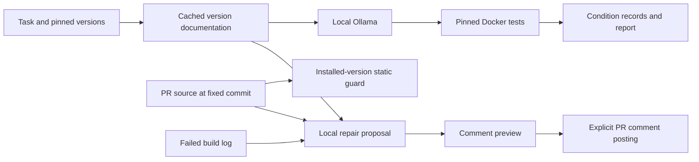

# Teammate handoff

**Scope update, 8 October 2026:** The teammate now performs only CodeLlama 7B
evaluation and returns its data/logs. Use [EVALUATION_ONLY.md](EVALUATION_ONLY.md).
Integration and assessment tasks described below are now the owner's work.

Delivery: `deliverables/VersionGuard-teammate.zip`. It contains source, tests,
workflows, the frozen benchmark dataset/split/cache, Qwen results, demo evidence
and a SHA-256 manifest. Environments, model weights, Git metadata, credentials,
vector databases and scratch files are excluded. The archive is ready to
share; it has not been sent or published.

## Laptop setup and second model

Extract the ZIP and open a terminal in its `VersionGuard` directory. Use
Python 3.12, Docker Desktop and Ollama 0.35.0 (matching the first laptop).
Verify the ZIP at its actual path, then install:

```powershell
python -m scripts.teammate_bundle --verify ../VersionGuard-teammate.zip
python -m venv .venv
.venv\Scripts\Activate.ps1
python -m pip install -r requirements.txt -r requirements-dev.txt -r requirements-ci.txt
```

On macOS/Linux, activate with `source .venv/bin/activate`. Optional vector
packages are unnecessary: lookup is cached. Do not reselect tasks or rebuild
the cache. Use `codellama:7b-instruct`; pull it only if absent from `ollama list`.
This is the recommended comparison because it is a different code-focused
model at approximately the same 7B scale as the completed Qwen run.

```powershell
ollama list
ollama pull codellama:7b-instruct
python -m experiment.doctor --model codellama:7b-instruct
python -m experiment.prepare --split all --verify-only --executor docker
python -m experiment.run --split dev --model codellama:7b-instruct --executor docker --limit 5
python -m experiment.run --split test --model codellama:7b-instruct --executor docker
python -m experiment.report --split test --model codellama:7b-instruct --require-complete
```

Stop if reference verification fails. Interrupted runs resume with the same
command. Do not use `--force` or change settings. Smoke checks belong to dev;
run the held-out test after the smoke check. Qwen is already complete;
`qwen2.5:7b` and `qwen2.5:7b-instruct` are aliases of the same local model.

Return `results/test-codellama_7b-instruct.jsonl` and its `.meta.json`, reference
verification output, and ten inspected failure examples. On the first laptop:

```powershell
python -m scripts.import_results incoming/test-codellama_7b-instruct.jsonl
python -m scripts.import_results incoming/test-codellama_7b-instruct.jsonl --apply
python -m experiment.report --split test --require-complete
```

Import rejects incomplete runs, changed inputs/settings and conflicting files.
The report keeps each model separate; speed is not compared across laptops.
The completed Qwen evaluation meets neither primary success rule.

## CI and guard demonstration

`.github/workflows/ci.yml` implements lint, tests/coverage, the fixture pipeline,
the guard demo and changed-application-file checking. Filenames with spaces are
preserved. Expected-invalid test/fixture files are checked by tests instead of
the changed-file guard. NumPy 1.26.4 is pinned for the demo.

CI can be exercised locally without Ollama or Docker. Hosted evidence needs a
Historical handoff note (superseded by `docs/LIVE_EVIDENCE.md`): the original
checkout initially had no remote. The source is now published and hosted checks
are verified. The broader workflow below is retained as historical context; push the source,
verify the Actions run, and protect `main` with the `checks` job. Workflow
permissions are read-only.

For the PR demonstration, create `demo/pr_example.py` from
`demo/broken.py.txt`. It should fail with `VG001` for removed `np.asscalar`.
Replace it with `demo/fixed.py` and show the guard pass. Save actual red/green
Actions screenshots. `results/guard-demo.json` is local evidence only.

## PR repair comment

Install GitHub CLI and authenticate with `gh auth login`. Run from a trusted
local checkout with Ollama available. Save the failed build/guard output as
`build.log`. Replace the repository and PR placeholders:

```powershell
python -m scripts.pr_repair --repo OWNER/REPOSITORY --pr 12 --code demo/pr_example.py --error-log build.log --library numpy --version 1.26.4
```

The command reads the PR file at a fixed commit and delegates to
`python -m versionguard.ask`. It does not check out, import or execute PR code.
It saves `results/pr-repair.md` and matching JSON. Use `--docs <file>` if the
pinned version is not installed locally. Static validation is explicitly
distinguished from running tests.

Review the preview. Repeating with `--post` explicitly publishes it after
checking that the PR head has not changed. Only your own existing VersionGuard
comment is updated. A changed head leaves the preview saved and blocks
posting. Hosted CI cannot reach your laptop's Ollama; there is no automatic
PR job on a local/self-hosted runner.

## Evidence still needed

- The second model's complete results from your laptop.
- Hosted Actions screenshots and a posted repair demonstration.
- Qodo tests, kept/discarded counts and measured coverage change.
- Sweep installation/PR evidence, or a concrete installation limitation.
- Failure notes, progress report and presentation.

Current project tests are not Qodo output. `results/coverage-baseline.json`
preserves the pre-integration baseline. To repeat local CI checks:

```powershell
python -m ruff check .
python -m coverage run -m pytest -q
python -m coverage report
python -m scripts.guard_demo
python -m experiment.run --split fixtures --model fake:stale --executor host
python -m experiment.report --split fixtures --require-complete
```

Fixture output demonstrates plumbing; it is not a model evaluation.

## Pipeline


