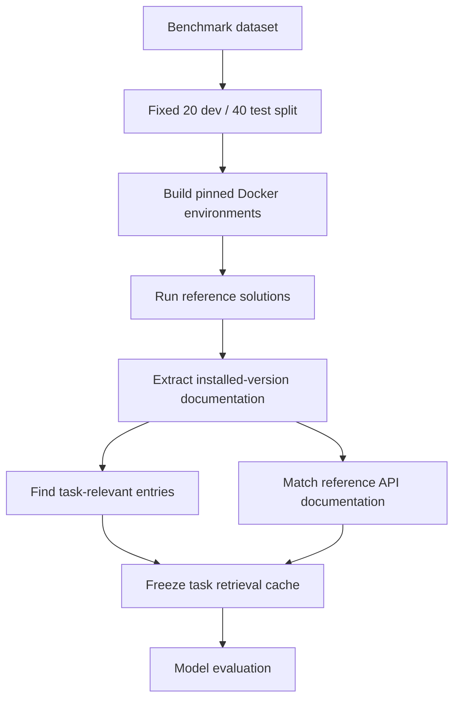
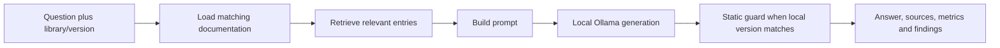

# VersionGuard: How the Project Works

An explanation of the current implementation and recorded results, checked
against the source on 8 October 2026. This guide explains the system; it does
not describe a new evaluation or change the completed experiment.

## 1. The problem we are solving

A language model can remember an API from a different library version. For
example, it can suggest `np.asscalar(array)` even though the NumPy version
installed in the project no longer provides `asscalar`. The code can look
plausible and still fail immediately.

VersionGuard addresses this at three points:

1. Before generation: retrieve documentation from the required version.
2. During review: statically flag selected calls that do not exist there.
3. After a failure: provide the failed code, error and documentation so the
   model can propose a repair.

The experiment asks whether documentation actually improves the proportion of
correct programs. A working documentation pipeline does not by itself prove
better answers; that is why we execute the answers and measure the outcome.

### Vocabulary

| Term | Meaning in this project |
|---|---|
| Library | Reusable Python functionality, such as NumPy, SciPy or SymPy |
| API | A public function, class, method or argument a library exposes |
| Distribution | The installable package; its name can differ from its import name |
| Pinned version | An exact required version, such as `numpy==1.25.0` |
| LLM | A language model used to generate code or text |
| 7B | Approximately seven billion model parameters, not seven million |
| Parameter | A learned numerical weight in the model; not a function argument |
| Inference | Using an already-trained model to produce an answer |
| Token | A model's unit of input/output text; it is not necessarily a whole word |
| Prompt | The messages and evidence supplied to the model |
| RAG | Retrieval-augmented generation: finding evidence and inserting it into a prompt |
| Reference solution | The benchmark's known solution, used to verify the environment |
| Oracle docs | Documentation selected using API names from that reference |
| Cell | One recorded task/condition outcome |
| Paired comparison | Comparing two answers on the same tasks |
| Fixture | A small controlled example for testing the pipeline |

No model is trained or fine-tuned by VersionGuard. RAG changes the input, not
the model's weights. This is a CLI system, not a web app or an autonomous
agent that keeps making edits until tests pass.

## 2. Technology stack and each tool's job

| Technology | Job | Where it appears |
|---|---|---|
| Python 3.10+ | Core application and experiment orchestration | `versionguard/`, `experiment/` |
| Python 3.12.3 | Host interpreter for the recorded Windows run | Run metadata |
| Python standard library | AST parsing, subprocesses, HTTP, JSON, CSV, hashing and statistics | Across the core |
| Ollama 0.35.0 | Locally serves installed generation models | `versionguard/llm.py` |
| Qwen 2.5 7B Instruct | Completed generation/evaluation model | `qwen2.5:7b-instruct` |
| CodeLlama 7B Instruct | Assigned second generation model on teammate's Mac | `codellama:7b-instruct` |
| LangChain Core/Ollama | Optional preferred model-client integration | `requirements.txt`, `llm.py` |
| Local Ollama HTTP API | Working fallback when the client package is absent | `/api/chat` |
| all-MiniLM-L6-v2 | Converts queries and docs into numerical vectors | Preparation/vector lookup |
| sentence-transformers/Hugging Face integration | Loads and runs that embedding model locally | `requirements-lookup.txt` |
| ChromaDB/LangChain Chroma | Stores and searches documentation vectors | `versionguard/store.py` |
| BM25 | Keyword retrieval without an embedding-model download | Standalone repair/demo and fixtures |
| Docker Desktop | Runs the Docker engine locally on Windows/Mac | Environment preparation and evaluation |
| Linux/AMD64 containers | Consistent task-specific execution environments | `experiment/executor.py` |
| GitChameleon 2.0 | Supplies coding problems, versions, tests and reference solutions | `data/gitchameleon.jsonl` |
| pytest | Automated regression and integration tests | `tests/` |
| coverage.py | Measures which core source statements tests exercised | Coverage JSON/report |
| Ruff | Detects selected Python style errors and likely coding mistakes | Local checks/CI |
| Git/GitHub Actions | Source history and hosted checks on pushes/PRs | Workflow implemented; hosting pending |
| GitHub CLI | Reads PR files and explicitly posts repair comments | `scripts/pr_repair.py` |
| JSONL/JSON | Appendable answer records, caches and metadata | `results/`, `experiment/` |
| CSV/Markdown | Analysis exports and human-readable reports | `results/` |
| ZIP/SHA-256 | Teammate delivery and file-integrity checks | `scripts/teammate_bundle.py` |
| Qodo | Planned generated-test evidence | Not yet completed |
| Sweep | Planned AI-generated PR demonstration | Not yet completed |

There are two different uses of models. The embedding model finds relevant
text; Qwen/CodeLlama writes the code. Chroma is a search store, not the code
generator. Ollama serves the generator; Docker executes the generated Python.

The real benchmark does not need to perform vector searches during inference:
its retrieved evidence has already been cached. The teammate does not need the
large optional embedding stack just to run the fixed evaluation. The bot's
interactive vector mode does need it; BM25 mode does not.

## 3. Repository map

| File or folder | What to read it for |
|---|---|
| `versionguard/config.py` | Shared defaults and environment-variable settings |
| `versionguard/task.py` | Task fields, pinned dependencies and environment keys |
| `versionguard/apidocs.py` | Extracting docs from installed Python packages |
| `versionguard/store.py` | BM25/vector lookup, diversification and doc budget |
| `versionguard/prompts.py` | Exactly what each condition tells the model |
| `versionguard/llm.py` | Ollama requests, generation settings and token/timing metrics |
| `versionguard/codeparse.py` | Turning an answer into candidate Python plus tests |
| `versionguard/check.py` | Static API checking |
| `versionguard/repair.py` | Outcome categories and sanitized error feedback |
| `versionguard/bot.py`, `ask.py` | Interactive generation/repair API and CLI |
| `experiment/fetch_data.py`, `select_tasks.py` | Obtaining data and fixing the task selection |
| `experiment/prepare.py`, `executor.py` | Reference checks, docs/cache and Docker execution |
| `experiment/doctor.py` | Readiness checks for Python, Ollama, model, Docker and cache |
| `experiment/run.py`, `report.py` | Resumable evaluation and analysis |
| `experiment/PROTOCOL.md` | The research contract fixed before test evaluation |
| `scripts/` | CI, PR, import and delivery helpers |
| `.github/workflows/ci.yml` | Hosted-check definition |
| `tests/`, `demo/` | Automated checks and the removed-API demonstration |
| `results/` | Recorded answers, metadata, reports and validation evidence |

The three main user commands are `versionguard.ask`, `versionguard.check`
and `experiment.run`. Preparation, reporting and integration helpers support
them without replacing the core interface.

## 4. Flow A: preparing a trustworthy experiment



### Task selection

The dataset is JSONL: each line is one JSON task object. A task includes its
ID, problem statement, incomplete starting code, expected Python/library
versions, tests and reference solution. It can also include extra dependencies,
API-call names, the kind of change and a separate visible test.

Selection uses a seed, groups tasks by library and distributes selected tasks
between development and test. The recorded library selection is explicit;
task IDs are then fixed in `experiment/splits/split.json`.

Our selection has 60 tasks: NumPy 6, SciPy 27 and SymPy 27. Twenty are dev and
40 are test, across 15 environments. Nine NumPy 1.21.0 tasks were excluded
before evaluation for prebuilt-package compatibility. This is a practical
selection limit, not a claim to represent all Python projects.

Development tasks are for checking and tuning. Test tasks are for the final
evaluation after settings are fixed. They are distinct task sets. Tests are
hidden from the generation prompt, not physically absent from the runner or
repository: the runner needs them to score the program.

### Why reference checks come before model runs

Suppose a model answer fails because the library could not install. That is
an environment failure, not evidence the model wrote bad code. We first run
the benchmark's reference solution in the same environment. If the reference
fails, preparation records that task as unusable and investigates the setup
before treating model output as meaningful.

All 60 selected tasks were successfully prepared in the current run.

### How environments are reused

The task defines Python plus dependency requirement strings. A stable key
hashes those requirements. Tasks with the same key share a Docker image, so
we do not build one image per answer. Host Python 3.12 does not imply every
benchmark task uses Python 3.12; its container uses the task's version.

### Where docs come from

VersionGuard imports the installed library inside its pinned environment,
walks supported public functions/classes/methods, and extracts the name,
signature and a shortened docstring. It does not scrape the latest website
and assume it applies to an older release. The extractor uses standard-library
code compatible with older task environments.

An entry might contain a name such as `numpy.ndarray.item`, its signature,
description, library and version. Extraction is finite and some callable
signatures cannot be inspected. Installed docs can describe present APIs;
they do not provide a complete history of removed APIs.

### What the cache fixes

For each task, preparation records the environment key, reference usability,
retrieved names/text, oracle names/text and retrieval-hit status. A SHA-256
hash identifies the cache file. Both model runs use these same bytes rather
than redoing lookup with potentially different installations/settings.

## 5. How retrieval works

The benchmark query is the task statement plus its starting code. It does not
search using the reference solution or scoring test. Oracle evidence is
constructed separately for the diagnostic oracle condition.

### Vector retrieval

1. The embedding model converts each documentation entry into a numeric vector.
2. Chroma stores those vectors.
3. The same embedding model converts the question into another vector.
4. Chroma finds nearby entries by its configured vector-distance search.
5. The code fetches more candidates than it will show and diversifies them.

This can match similar meaning even without identical words. It does not
prove that the selected API solves the task. The recorded distance is a search
ranking value, not a probability the answer will pass. Smaller distances rank
closer under this API; they cannot be compared directly to BM25 scores.

### BM25 retrieval

BM25 matches word pieces. The implementation splits dotted names, snake_case
and camelCase, and lowercases tokens. It gives rare matching terms more weight,
reduces the effect of repeatedly occurring terms and adjusts for document
length. It weights API names by repeating their tokens three times. Parameters
are `k1=1.5` and `b=0.75`.

Larger BM25 scores rank more relevant matches. These are retrieval scores,
not code-correctness scores. BM25 is useful offline and avoids loading the
embedding stack, but exact wording can matter more than in vector lookup.

### Diversification and prompt budget

With top-k 3, the code fetches up to 18 raw candidates, then retains one
entry per final function name and prefers its shortest API path. This prevents
three copies of `any` under different NumPy objects from consuming the whole
prompt. It is a heuristic: same final names do not always mean identical APIs.

The maximum documentation text shown is 2400 characters, shared among the
selected entries. A long docstring is truncated. Characters are not tokens;
2400 characters is not 2400 tokens. Equal character budgets reduce one source
of unfairness between documentation conditions but do not make every prompt
the same length.

## 6. Flow B: asking the bot and checking a proposal



The bot normally derives the installed library version. An explicitly supplied
version must agree with its documentation; otherwise the user must supply
docs from the requested environment. It returns source names so you can inspect
the evidence used, not just the generated code.

Qwen and CodeLlama are already-trained instruction models. The request supplies
a system instruction, task and evidence. The model emits tokens until completion
or the output cap. Temperature 0 reduces sampling randomness; it does not
make different hardware, model files or runtimes mathematically identical.

The configured context is 4096 tokens and output cap is 768 tokens. Prompt
size and runtime context behavior can affect answers, especially with docs and
repair logs. An output cap is a maximum, not a requirement to generate that
many tokens. Truncation is one possible reason an answer contains unusable code.

The guard parses the code using Python's AST. For `import numpy as np`, it
can resolve `np.asscalar` to `numpy.asscalar` and inspect the installed NumPy.
It can also check supported function keyword signatures. This is deterministic
inspection rather than another LLM deciding whether the code looks right.

| Code | Meaning |
|---|---|
| VG000 | Python syntax could not be parsed |
| VG001 | A resolved attribute/API does not exist |
| VG002 | A checkable call uses an unsupported keyword argument |
| VG003 | A referenced library module is unavailable |
| VG004 | A resolved API emits a deprecation warning |

Errors normally produce exit code 1; input/setup problems produce code 2.
Warnings normally do not fail the command, unless strict behavior is requested.
Conditional/optional usage has different handling from unconditional calls.

The guard cannot generally infer the type of `array` and prove every
`array.item()` call is valid. It also cannot prove a numerical answer is
correct. A missing function can be caught statically; a wrong formula needs
functional testing. Imports of installed libraries are needed for inspection,
so this is not a universal sandbox for arbitrary packages.

The bot reports `not_checked` if the requested library version differs from
the host installation. In our NumPy 1.25.0 demo, the host has 1.26.4, so the
proposal is instead functionally verified in the correct Docker image.

## 7. Flow C: six controlled evaluation conditions

Each condition changes the evidence given to the same model on the same
task. Benchmark conditions share a system instruction and layout. Comparing
them is an ablation study: add one kind of evidence and see whether outcomes
change. It is not six different models.

| # | Condition | Input to the model | Question it answers |
|---|---|---|---|
| 1 | Task only | Problem + starting code | What can the model do without explicit versions/docs? |
| 2 | Version | 1 + Python and dependency versions | Does knowing the target version help? |
| 3 | Lookup | 2 + retrieved docs | Does the retrieval system improve generation? |
| 4 | Oracle | 2 + reference-API-selected docs | What happens with reference-informed evidence? |
| 5 | Repair log | 2 + its failed answer + sanitized log | Does one feedback-based retry help? |
| 6 | Repair docs | 5 + the same retrieved docs as condition 3 | Do docs add benefit during repair? |

Condition 4 never gives the model the reference implementation. It uses the
reference's named APIs to pick documentation. Matching tries an exact dotted
name, then progressively shorter dotted prefixes, and caps the docs at three.
Variable-method calls may be unmatchable, so oracle docs are not available for
every task. Even reference-informed docs are not a perfect upper bound: they
can be partial, shortened or misunderstood.

Conditions 5 and 6 both start from condition 2. Condition 6 is not a repair
of condition 3, and not a second repair after condition 5. They are two
alternative one-round repairs of the same initial failure. They do not loop
until passing. This makes their comparison about documentation, not about
giving one path extra attempts.

If condition 2 already passed, both repair outcomes retain that pass without
another model call. If it failed, each repair condition makes one new call.

### What gets executed

The code parser accepts a full program, a completed function/class, or a
function-body continuation. It parses the candidate, adds the necessary
starting-code preamble where appropriate, and appends the benchmark test.
If it cannot construct usable Python, the outcome is `no_code`.

The program runs in Docker, with network disabled, a read-only root filesystem,
a temporary filesystem, resource limits and a time limit. The runner captures
the exit code, stderr and elapsed time. Passing means the constructed program
exited successfully under that task's tests. It does not mean proof of correctness
for every possible input, and there is no text-similarity score against the
reference solution.

The guard is not an extra scoring filter for benchmark answers. The benchmark
score comes from executing the candidate with tests. Adding a guard-based retry
would be a different experimental condition.

### Keeping repair feedback honest

The model does not receive scoring test code. The runner removes test frames
from tracebacks and substitutes a generic message for assertions that might
contain expected values. It keeps candidate frames and limited library frames,
with a 1200-character feedback cap. When a separate visible test is present,
repair feedback is generated from that test; otherwise it uses sanitized
feedback from the scoring test. This is a disclosed methodological limitation,
not a fully separate development-test/hidden-test repair setup in every task.

## 8. Why records and model calls have different counts

For the held-out set, 40 tasks times six conditions gives 240 records.

| Source | Model calls | Recorded cells |
|---|---:|---:|
| Task only | 40 | 40 |
| Version | 40 | 40 |
| Lookup | 40 | 40 |
| Oracle available | 22 | 22 |
| Oracle unavailable | 0 | 18 skipped |
| Repair log, initially failed tasks | 22 | 22 |
| Repair log, initial passes | 0 | 18 carried |
| Repair docs, initially failed tasks | 22 | 22 |
| Repair docs, initial passes | 0 | 18 carried |
| Total | 186 | 240 |

Development has 120 records from 90 generations, 20 carried cells and 10
oracle skips. Combined: 360 records from 276 generations. Counting carried
passes as fresh calls would exaggerate model workload and distort timing.

JSONL saves a record after every completed cell and includes task, condition,
answer, assembled code, outcome, failure category, docs shown, feedback and
metrics. A matching JSON metadata file records run settings and provenance.
Resuming skips cells already saved; it is not another evaluation of those cells.

## 9. Primary metric: test-pass rate

```text
pass rate = tasks whose program passes / scored tasks
percentage = pass rate * 100
```

All 40 tasks normally have equal weight. We are not scoring individual assertions
and giving a task partial credit. If one task's program fails an assertion, that
task is a failure. Missing oracle docs are excluded from the oracle denominator
rather than automatically scored as model mistakes.

| Qwen held-out condition | Arithmetic | Meaning |
|---|---|---|
| Task only | 21 / 40 = 52.5% | 21 programs passed without explicit version/doc blocks |
| Version | 18 / 40 = 45.0% | Explicit version evidence produced 18 passes |
| Lookup | 21 / 40 = 52.5% | Retrieved evidence produced 21 passes |
| Oracle | 10 / 22 = 45.5% | 10 passes among 22 oracle-eligible tasks; 18 skipped |
| Repair log | 22 / 40 = 55.0% | 18 initial passes retained + 4 repairs succeeded |
| Repair docs | 22 / 40 = 55.0% | 18 initial passes retained + 4 repairs succeeded |

Oracle 45.5% cannot be compared directly with lookup 52.5% as if they cover
the same 40 tasks. On the shared 22 tasks, lookup passes 11/22 = 50.0% and
oracle passes 10/22 = 45.5%. The paired report uses this common subset.

One task on a 40-task set changes the rate by 2.5 percentage points. On the
22-task oracle subset it changes it by about 4.55 points.

## 10. Paired improvements, gains and losses

The comparison looks at each same task under two conditions:

| Baseline | Treatment | Per-task difference |
|---|---|---:|
| Fail | Pass | +1: gained task |
| Pass | Fail | -1: lost task |
| Pass | Pass | 0 |
| Fail | Fail | 0 |

```text
difference in points = 100 * (gained - lost) / paired task count
```

For lookup versus version: 6 gains and 3 losses. Therefore:

```text
100 * (6 - 3) / 40 = +7.5 percentage points
52.5% - 45.0% = +7.5 percentage points
```

Of these 40 tasks, 15 pass both, 6 pass lookup only, 3 pass version only and
16 fail both. Looking only at the net gain hides the three regressions.

For repair docs versus log: one gained task and one lost task cancel out.
Equal totals do not mean identical repaired tasks.

Percentage points and relative percentages differ. Moving from 45% to 52.5%
is +7.5 points but a relative increase of 7.5/45 = 16.7%. The registered
threshold is points, not relative increase. It cannot be met by describing
the same gain as a larger relative number.

## 11. The confidence interval, step by step

One selected set of 40 tasks is uncertain evidence about similar tasks.
The paired bootstrap estimates the variability of the measured gain:

1. Start with all 40 per-task paired differences.
2. Sample 40 task pairs with replacement. Some tasks repeat; others are absent.
3. Calculate the average difference for that resampled set.
4. Repeat 10,000 times with the statistics seed `20261007`.
5. Sort those differences and use roughly the 2.5th and 97.5th percentiles.

Pairs stay together. We do not independently sample the two conditions, which
would throw away information about shared task difficulty.

The lookup interval is [-7.5, +22.5] points. It spans negative, zero and
positive effects, so the observed +7.5-point advantage is not strong evidence
of a reliably positive population effect under this procedure.

The docs-vs-log repair interval is [-7.5, +7.5]. Its net gain is zero, but
resampling the gained/lost tasks produces uncertainty around that zero.

A frequentist 95% interval does not literally mean a 95% probability that the
true effect lies inside this particular interval. It describes an estimation
procedure intended to cover the population effect in about 95% of repeated
comparable studies under its assumptions. A small selected benchmark may not
represent a broad real-world population, so generalization needs care.

## 12. The permutation p-value

The null hypothesis here is that there is no directional difference between
the two conditions. The sign-flip test asks whether their observed advantage
is unusual if condition labels were exchangeable within each task.

The implementation takes the discordant pairs (the gains and losses), randomly
flips their signs 10,000 times and counts how often the absolute total is at
least as large as the observed total. It uses a small Monte Carlo correction:

```text
p = (extreme simulated totals + 1) / (10,000 + 1)
```

Lookup's p=0.510 means a result at least this imbalanced occurs often under
that null simulation. It is not a 51% probability that the model is wrong or
that documentation is useless.

Repair docs has observed difference zero. Every simulated absolute difference
is at least zero, so p=1.000. This is not proof the methods are equivalent;
detecting equivalence would need a different question and method.

The bootstrap interval and permutation p-value are different procedures. They
can disagree on a small discrete dataset. Here repair log versus version has
a bootstrap interval [+2.5, +20.0] but p=0.126. Do not call that comparison
significant at p<0.05. It is a descriptive improvement, not the primary
documentation-benefit decision.

## 13. The registered decision and every paired row

The primary rule was fixed before the held-out run:

```text
useful documentation benefit requires:
    measured gain >= 10 percentage points
    AND the confidence interval's lower bound > 0
```

At 18 version passes, lookup would need at least 22/40 plus a strictly positive
lower interval. At 22 log-repair passes, docs-repair would need at least 26/40
plus that interval requirement. Pass counts alone cannot determine the
interval; task-level gains/losses also matter.

| Comparison | Difference and interval, points | p | Explanation |
|---|---|---:|---|
| Lookup vs version | +7.5 [-7.5, +22.5] | 0.510 | Below 10-point threshold and interval includes zero |
| Repair docs vs log | 0.0 [-7.5, +7.5] | 1.000 | No aggregate gain and interval includes zero |
| Version vs task only | -7.5 [-20.0, +5.0] | 0.457 | Version prompt loses 5 tasks and gains 2; uncertain worsening |
| Oracle vs lookup, shared 22 | -4.5 [-13.6, 0.0] | 1.000 | Oracle loses one task and gains none; too little evidence to conclude superiority |
| Repair log vs version | +10.0 [+2.5, +20.0] | 0.126 | Four recovered tasks, no lost initial passes; descriptive only |

Only the first two rows answer the registered primary questions. The generic
report labels the last row `useful` using its gain/interval function, but it
is unbolded and descriptive. It is not a third registered success or proof
that documentation helps repairs.

`No effect detected` means the current evidence does not establish the desired
benefit. It does not establish a zero effect for all models/tasks. The measured
lookup gain is real for this selected sample but uncertain beyond it.

## 14. Retrieval quality: reading section 3 of the results

The retrieval-hit check asks whether at least one retrieved name matches the
oracle's reference-API documentation names. It only runs where an oracle exists.
This is a task-level hit measure, not full precision/recall, semantic correctness
or a guarantee every required API was retrieved.

```text
hit rate = 19 / 22 = 86.4%
lookup pass rate on hits = 8 / 19 = 42.1%
lookup pass rate on misses = 3 / 3 = 100%
oracle unavailable = 18 / 40 tasks
```

The 100% miss-group score comes from three tasks, not 40. It does not mean
retrieval misses are beneficial. Easier tasks, alternative valid APIs and the
limited reference-name definition can all affect this relationship.

The other 18 tasks are unclassified for retrieval-hit purposes. Lookup still
runs on them. Oracle absence means the reference names could not be matched,
not that all documentation is absent.

## 15. Failure categories: reading section 4

The runner assigns one category from execution outcome and final exception.
This is reproducible automatic labeling, not a full root-cause investigation.

| Category | How it is assigned | Example |
|---|---|---|
| Wrong result | AssertionError | Function runs but returns an unexpected value |
| API missing | AttributeError, ImportError or ModuleNotFoundError | `np.asscalar` unavailable |
| Wrong arguments | TypeError with recognized call-signature wording | Unsupported keyword such as `factor=` |
| Other error | Other failure/exception | ValueError, NameError or unclassified error |
| No code | Candidate cannot be assembled | Missing required function or unusable output |
| Timeout | Execution exceeds the limit | Nonterminating or excessively slow program |

An AttributeError may arise from incorrect value/type handling rather than a
removed library API, so manual inspection is needed before calling every
`api_missing` record a version hallucination. Likewise, a TypeError unrelated
to the recognized signature phrases belongs to `other_error`.

| Condition | Failed | Wrong result | API missing | Wrong arguments | Other error | No code | Timeout |
|---|---:|---:|---:|---:|---:|---:|---:|
| Task only | 19 | 8 | 4 | 0 | 6 | 1 | 0 |
| Version | 22 | 10 | 6 | 0 | 6 | 0 | 0 |
| Lookup | 19 | 13 | 2 | 0 | 4 | 0 | 0 |
| Oracle, 22 eligible | 12 | 10 | 1 | 0 | 1 | 0 | 0 |
| Repair log | 18 | 10 | 3 | 0 | 5 | 0 | 0 |
| Repair docs | 18 | 8 | 3 | 1 | 6 | 0 | 0 |

Lookup has fewer API-missing outcomes than version-only, but more wrong-result
outcomes. This suggests documentation may address API selection while leaving
task reasoning unresolved. Aggregate category changes alone do not prove which
failure transformed into which; inspect paired task code/logs for that claim.

Zero recorded timeouts means these answers completed within the execution
limits, not that generation can never hang. Generation and program execution
have separate timeout handling.

## 16. Repair recovery: reading section 5

There are 22 failed initial version answers. Each repair method fixes 4:

```text
repair recovery rate = 4 / 22 = 18.2%
final end-to-end pass rate = (18 initial passes + 4 repairs) / 40 = 55%
```

18.2% and 55% answer different questions. The first asks how many actual failed
programs a retry repaired. The second asks what fraction of all tasks is correct
after one allowed repair round. The report's headline repair score is the latter.

Because existing passes are retained rather than regenerated, repair cannot
lose those baseline passes by construction. That must be considered when
interpreting repair-vs-no-repair gains. Comparing docs and log repairs is fairer
for the documentation question because both get the same opportunity to retry.

## 17. Change types: reading section 6

These groups come from benchmark labels and are descriptive. They do not
receive equal weight; the overall score is task-weighted.

| Change type | Tasks | Version | Lookup | Repair docs |
|---|---:|---:|---:|---:|
| Argument or attribute change | 15 | 40.0% | 33.3% | 40.0% |
| New function/method/class | 10 | 30.0% | 50.0% | 50.0% |
| Breaking change | 7 | 57.1% | 100.0% | 85.7% |
| Deprecation | 4 | 100.0% | 100.0% | 100.0% |
| Argument change | 1 | 0.0% | 0.0% | 0.0% |
| Name change | 1 | 0.0% | 0.0% | 0.0% |
| Other library/new feature | 1 | 0.0% | 0.0% | 0.0% |
| Output change | 1 | 100.0% | 0.0% | 100.0% |

100% in a one-task group means one pass. 0% means one failure. Neither provides
a stable population estimate. The seven breaking-change tasks are an interesting
lookup pattern, but selecting that favorable group after seeing results should
not replace the predeclared overall test comparison.

## 18. Provenance, time and tokens: sections 7 and 8

A model digest identifies installed model content more precisely than its
tag. `qwen2.5:7b` and `qwen2.5:7b-instruct` have the same digest locally and
must not be counted as two independent models. Qwen's recorded digest starts
`845dbda0ea48`.

Dataset, split, cache and protocol SHA-256 hashes identify experiment inputs.
Hash checks detect changed files; they do not prove scientific validity. Task
data hashing normalizes line endings for Windows/Mac portability. Legacy dev
metadata lacks dataset/split hashes; held-out metadata includes them.

| Timing column | Meaning |
|---|---|
| Generated answers | Actual model calls, excluding carried/skipped cells |
| Median seconds | Middle model-request latency for this condition |
| Model minutes | Sum of model-request latency divided by 60 |
| Input tokens | Total prompt tokens reported by Ollama |
| Output tokens | Total generated tokens reported by Ollama |

| Condition | Calls | Median seconds | Model minutes | Input tokens | Output tokens |
|---|---:|---:|---:|---:|---:|
| Task only | 40 | 5.5 | 4.9 | 5592 | 3827 |
| Version | 40 | 4.4 | 4.0 | 7293 | 3196 |
| Lookup | 40 | 3.9 | 4.1 | 18307 | 3079 |
| Oracle | 22 | 3.6 | 1.6 | 7395 | 1255 |
| Repair log | 22 | 6.3 | 3.2 | 8238 | 2401 |
| Repair docs | 22 | 6.2 | 3.3 | 14049 | 2462 |

Docs increase prompt tokens substantially. Input/output token totals do not
measure correctness. A short wrong answer can be faster than a correct one.
Median latency and total minutes are different: a few slow calls can increase
the total without moving the median much. Model loading, prompt processing,
generated length and system load all affect latency.

The 26.2-minute test duration also includes container starts, program execution,
logging and runner overhead. It is not equal to the model-time column total.
Per-record `exec_ms` includes executor elapsed time and container startup, so
it is not pure algorithm runtime. Speeds on the teammate's Mac should be reported
separately rather than attributed solely to model quality.

## 19. Engineering metrics are separate from model scores

The latest automated verification is 89 passed tests and 2 passed subtests,
with Ruff passing. These tests cover our implementation, not 89 benchmark
questions solved by Qwen. Fixtures include scripted models with known outcomes
so we can check generation, assembly, execution, failure handling and reports
without Ollama.

Core statement coverage is 69% rounded. It means tests executed about 69% of
configured source statements, not that the model is 69% accurate or the tool
is 69% correct. Some helpers are tested but not in the coverage denominator.
Coverage is not proof that assertions adequately verify every path.

The local guard demo checks that removed `np.asscalar` is rejected under NumPy
1.26.4 and the corrected example passes static checking. Separate Docker checks
verified the standalone `array.item()` proposal under NumPy 1.25.0. The initial
invalid `np.item(array)` proposal remains saved; the successful demo used a
clarified question, so it should not be presented as an unbiased retry metric.

## 20. CI, PR repair and teammate workflow

GitHub CI installs minimal development dependencies and pinned NumPy, runs
lint, tests/coverage, the fixture pipeline and guard demo, then checks changed
application Python files on PRs. It uploads verification artifacts. It does
not run a real Ollama benchmark on every PR or automatically repair PR code.
Real hosted runs and branch protection still need external verification.

The PR repair helper fetches the specified file at a fixed head commit via
GitHub CLI and passes it as text to the bot. It saves a comment preview.
Explicit `--post` checks the PR head again and posts/updates only the user's
own marked VersionGuard comment. It does not check out or execute the PR code,
apply a patch, commit or merge. Live API behavior remains to be demonstrated;
current integration tests mock the network calls.

The teammate has been assigned CodeLlama 7B Instruct on the Mac, with the same
task split, cached evidence, generation settings and pinned Docker tests.
They first verify references, use dev for the smoke check, then run the full
held-out test. The returned JSONL and metadata are validated before import.
The final report analyzes each model separately under the same primary rule.

CodeLlama is an approximately same-size model-family comparison. Better scores
are not guaranteed; equal parameter count does not equal identical training,
architecture or quantization. Do not switch models repeatedly to select only
a favorable result or alter the frozen Qwen experiment after observing test
scores.

The verified ZIP carries source, frozen inputs and results with a file manifest.
The user reports having sent the teammate work. CodeLlama results, hosted
Actions/PR evidence, Qodo coverage comparisons, Sweep evidence and final
presentation material have not yet been returned.

## 21. What you should be able to explain in a review

1. VersionGuard retrieves documentation from the target installation rather
   than assuming a model remembers that version.
2. Retrieval, static API checking and functional test execution do different
   jobs. None guarantees the other two succeeded.
3. The same task under controlled evidence conditions is the unit of comparison.
4. Both repair paths start from the same version-only failure and get one retry.
5. Pass rate measures functional success; recovery rate measures repaired failures.
6. Paired gains and losses explain why a higher total can hide regressions.
7. Confidence intervals and permutation tests measure uncertainty differently.
8. The Qwen run has not established either registered documentation benefit.
9. That does not invalidate the working guard or imply documentation never helps.
10. The second model and hosted demonstrations complete the remaining evidence;
    they do not justify rewriting the current outcome.

Primary evidence: `results/report-test.md`, the model JSONL/metadata, the
registered `experiment/PROTOCOL.md`, and the implementation files named above.
